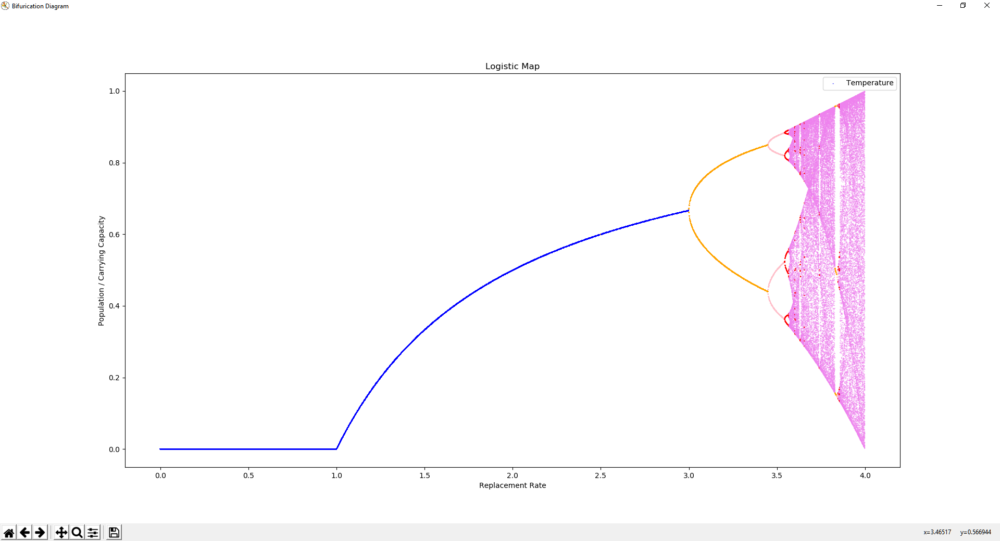
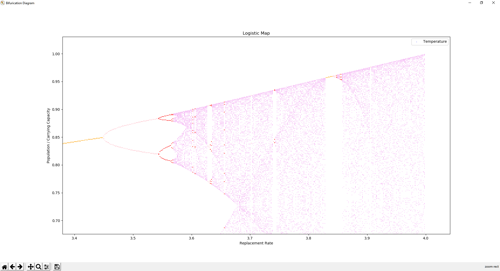

# Bifurcation-Diagram
Bifurcation diagrams show the state values visited by a system over a given time period for different system hyperparameter settings. In this diagram, each X value represents a hyperparameter value for the system and the corresponding Y values are the states visited. These diagrams are commonly used to visualize the orbital periods of systems. If a changes in hyperparameter values tend to result in almost the same state spaces, the system is considered stable for those hyperparameter values.


## Logistic Map
The Logistic Map is a non-linear dynamical equation modelling the population of a species over generations.

```
x(n+1) = rx(n)(1-x(n))
x(0) = .5
```

Where x(n) is the percent of the enviornment capacity that the population of generation n occupies. r is a hyperparameter representing growth rate with a domain of [0, 4].

Changing the value of r creates different orbits and attractors, as seen in the bifurication diagram. As r increases, bifurications occur and the period of the orbit doubles. Eventually, at roughly r=3.8, the system begins to produce chaos, sometimes breifely becoming stable again. 

Color of the dots is the number of unique values in the orbit.



The Logistic Map is a strange attractor, it is self repeating at multiple scales, visualized below.



## More
[Logistic Map Blog Post](https://geoffboeing.com/2015/03/chaos-theory-logistic-map/)

[Bifurication Diagram](https://en.wikipedia.org/wiki/Bifurcation_diagram)

[Bifurication Theory](https://en.wikipedia.org/wiki/Bifurcation_theory)

[Logistic Map](https://en.wikipedia.org/wiki/Logistic_map)
