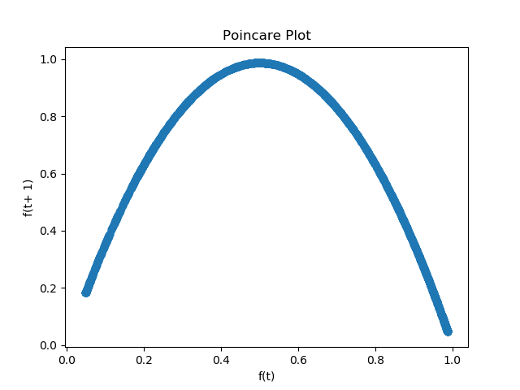
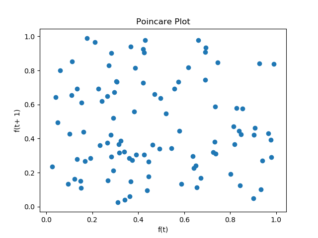

# Bifurcation-Diagram
Bifurcation diagrams show the states visited by a system over a given time period, across system hyperparameter values, showing the attractors of a system. A stable system is shown when changes in hyperparameter values tend to result in similar orbits, while chaos is shown when the orbits begin to change rapidly. This code is capable of visualizing the bifurication diagrams of discrete dynamical systems, especially with low dimensional rules. The X axis represents a hyperparameter and the Y axis represents a state variable. 


## Logistic Map
The Logistic Map is a non-linear dynamical equation modelling the population of a species over generations.

```
x(n+1) = rx(n)(1-x(n))
x(0) = any number in (0, 1)
```

Where x(n) is the percent of the enviornment population capacity occupied by generation n. r is a hyperparameter representing growth rate with a domain of [0, 4].

Changing the value of r creates different attractors, as seen in the bifurication diagram. As r increases, bifurications occur where the orbital period doubles. Eventually, at roughly r=3.6, the system becomes chaotic, with intermittent stablity.

Color of the dots is the number of unique values in the orbit.


The Logistic Map is a strange attractor, it is self repeating at multiple scales. At roughly r=3.85, a triple bifurication followed by chaos is shown at three heights, that look very much similar to the larger triple bifurication starting at r=3.0, followed by chaos at r=3.6.


These similarities are present all over the the diagram. The chaotic region is not random, the attractors within it represent unknown patterns governed by emergent properties of simple dynamics.

Color of the dots is the entropy of the points shown.


## Chaos vs Randomness
A useful tool in distinguishing chaos and randomness is the poincare plot. The poincare plot is a visualization of a time series of the state space. With points (f(t), f(t+1)) for all t, this plot clearly illustrates constraints on the state space and state change dynamics. 
All y values along x=1 represent states have come after f(t) = 1.

Poincare plot for the logisitic map.


Poincare plot of uniform random samples.



## More
[Logistic Map Blog Post](https://geoffboeing.com/2015/03/chaos-theory-logistic-map/)

[Bifurication Diagram](https://en.wikipedia.org/wiki/Bifurcation_diagram)

[Bifurication Theory](https://en.wikipedia.org/wiki/Bifurcation_theory)

[Logistic Map](https://en.wikipedia.org/wiki/Logistic_map)

[Poincare Plot](https://en.wikipedia.org/wiki/Poincar%C3%A9_plot)
